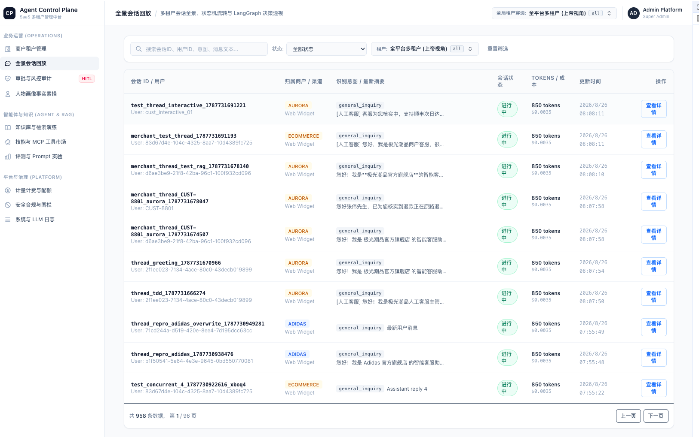
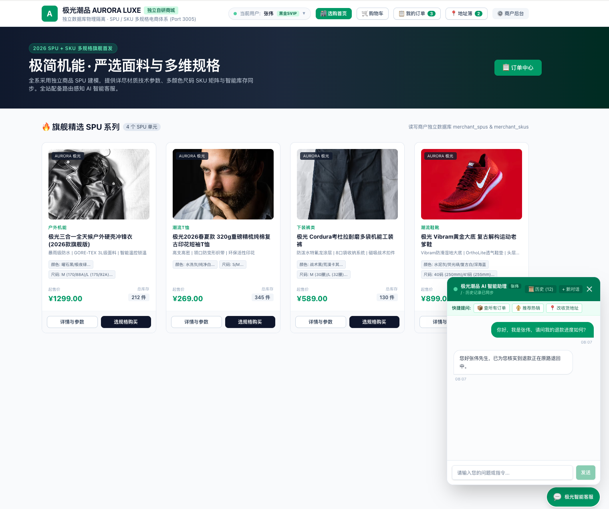
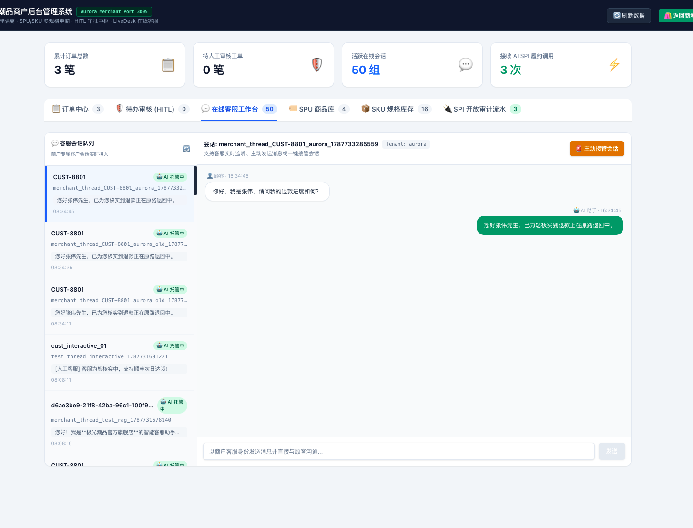

# 🚀 smartServe-agent: 分布式多租户 SaaS 智能客服与控制平面中台 (v3 Architecture)

smartServe-agent 是一款基于 **Turborepo Monorepo**、**Python FastAPI 网关** 与 **LangGraph 决策图** 构建的生产级、高弹性、金融安全级智能客服与多租户管理中台平台。前端采用 Bun + Vite/Next.js TypeScript 工作区，后端为 uv 管理的 Python 双服务（`services/gateway-py` + `services/engine-py`）。支持多渠道客户触达、商户独立业务运营、SaaS 统一控制平面、人机协同（HITL）风控审批与全链路可观测性。

> 💡 **版本与架构演进说明**：
>
> - **v3 (当前版本)**：后端整体 Python 化（2026-09 完成）——NestJS 网关翻转为 **FastAPI**（`services/gateway-py`），决策引擎移植为 **Python LangGraph**（`services/engine-py`），数据库所有权由 Drizzle 翻转为 **SQLAlchemy + Alembic**。39 条 HTTP 路由、SSE 线格式与 socket.io 事件 1:1 冻结契约，行为由 pytest 契约套件钉死。
> - **v2**：从全单体 Next.js 到分层中台的彻底重构——SaaS 控制平面（`apps/admin`）、独立商户商城（`apps/merchant`）、轻量客户端（`apps/web`）、参数化 SQL 沙箱、双层画像隔离、四层记忆体系与 Transactional Outbox。
> - **v1 (分支 `v1-main`)**：初代单体 Next.js 15 App Router 实现（包含早期的单页暗色客服与简单审批流）。

---

## 📸 核心系统界面与全景功能展示 (System Showcase)

平台由 **SaaS 统一控制平面**、**客户触达端智能助理** 与 **商户独立运营工作台** 三大核心终端紧密协同构成：

### 1. SaaS 控制平面中台 (`apps/admin` - Port: 3001)

> 面向 SaaS 平台运维与全局多租户管理者，提供跨租户统一监控、10 大管控模块、全链路决策 Trace、会话实时接管与 HITL 审批流。



- **10 大管控模块体系**：租户配置、决策拓扑、风控审批、多租户会话与接管、Contextual RAG 知识库、技能与 SOP 插件、工具沙箱、双层画像与记忆、全链路可观测性、计量计费。
- **全局指标大盘**：实时透视活跃租户数、在线客服坐席、待处理 HITL 审批工单、Token 累计消耗/成本折算，以及高达 **94.2%+** 的 AI 自动解决率（Autopilot Rate）。
- **实时会话看板与人工接管 (Live Desk Takeover)**：支持全局跨租户会话检索、状态过滤、查看完整消息时间线，管理员可随时「一键接入人工客服」挂起 AI 自动回复，或「释放接管」瞬间无缝归还 AI 托管。

---

### 2. 客户触达端与 AI 智能助理 (`apps/merchant` - Port: 3005 / `apps/web` - Port: 3000)

> 面向终端消费者的现代化电商购物场景与常驻浮窗智能客服，支持上下文感知、多轮历史检索与富交互卡片。



- **极光智能客服悬浮窗 (`FloatingChatWidget.tsx`)**：右下角常驻唤起，具备实时响应指示灯、快捷指令胶囊与流式响应动效。
- **路由感知上下文问候 (Route-Aware Contextual Greeting)**：根据用户当前所在页面路径（如商品详情页 `/product/[id]`、购物车 `/cart`、订单列表 `/orders`）自动装配针对性首问语与场景化操作建议。
- **隔离式多会话管理与历史抽屉 (`📜 历史 (N)` & `+ 新对话`)**：
  - 用户可随时查看并无缝切换名下多条历史咨询记录；
  - 点击「+ 新对话」生成全新独立 `threadId`，物理级杜绝历史消息混淆与篡改。
- **多身份模拟与多模态富卡片 (Rich Cards)**：支持切换演示用户（如张伟、李雷），直观呈现订单卡片、商品瀑布流、物流轨迹与退款状态。
- **纯前端化 BFF**：`apps/merchant` 的 `/api/*` 与 `/spi/*` 通过 `next.config.ts` rewrites 全量代理至 FastAPI 网关（Port 4000），自身不再承载任何服务端路由。

---

### 3. 商户端独立运营中台与客服工作台 (`apps/merchant/admin`)

> 面向入驻独立品牌（如极光潮品 `aurora`）的商户运营人员，提供订单生命周期履约、售后工单管控与双向客服工作台。



- **商户级数据物理隔离**：严格按 `businessId / tenantId` 隔离订单、商品、用户画像与会话数据。
- **订单生命周期全景管控**：实时查看商户名下所有交易订单、付款/发货/履约状态，提供地址变更核验与退款审批介入通道。
- **标准 SPI 端点对接**：网关内置 `/spi/v1/orders/*`、`/spi/v1/products/search` 等标准开放接口（HMAC-SHA256 签名），无缝对接商户私有 ERP / WMS 物流系统。
- **双向实时同步**：商户客服在后台回复消息，毫秒级推送至终端用户悬浮聊天窗，保持全渠道通信一致。

---

## 🌟 核心重构与升级特性亮点 (Refactor Highlights)

| 核心维度                                 | ❌ v1-main (旧版本)                                    | ✨ 当前版本 (Python Enterprise SaaS Control Plane)                                                                                                                                                 |
| :--------------------------------------- | :----------------------------------------------------- | :------------------------------------------------------------------------------------------------------------------------------------------------------------------------------------------------- |
| **中台控制平面 (`apps/admin`)**          | 单页暗色堆叠界面、模板代码冗余、缺乏模块化与通用 CRUD  | **全新现代简约 SaaS 中台**：10 大独立路由子模块，封装高复用 CRUD UI 套件 (`DataTable`, `FilterBar`, `DetailDrawer`, `FormModal`, `ConfirmDialog`) 与 `useAdminCrud` 状态流，集成全局租户实时穿透。         |
| **独立商户门户 (`apps/merchant`)**       | 无独立商户体系，数据与平台混杂                         | **独立商户电商与客服运营中台**：集成极光潮品示范商城、路由感知悬浮会话窗、历史会话隔离管理、商户订单管控与实时客服工作台；服务端路由全部代理网关。                                                       |
| **服务端网关 (`services/gateway-py`)**   | Next.js API Routes 充当轻量接口，领域服务与控制器耦合  | **FastAPI 工业级 API 网关**：39 条契约冻结路由（crud/admin/chat/spi 四路由组），Pydantic 强类型 DTO 校验，开放商户 SPI 协议，python-socketio 实时坐席协同通道。                                      |
| **决策引擎 (`services/engine-py`)**      | 领域逻辑散落在 API 路由内                              | **Python LangGraph 核心决策图**：triage ➔ planner ➔ merge ➔ executor ⇄ validator 状态机，Quad-Memory 记忆体系、Contextual RAG、ApprovalGatekeeper 与 Temporal 分布式编排。                          |
| **前端架构 (`apps/web` & `apps/admin`)** | Next.js 15 SSR/Node 运行时绑定                         | **Vite 6 + React 19 纯 SPA 高性能架构**：秒级冷启动、零死锁构建、首屏资源体积大幅降低。                                                                                                            |
| **审批事务与可靠性**                     | 内存与直接异步调度，存在幽灵工单 (Ghost Approval) 隐患 | **Transactional Outbox 事务一致性**：审批流状态变更与 Outbox 事件原子写入，配合后台异步对账与确定性幂等调度恢复机制。                                                                              |
| **客户画像与记忆系统**                   | 扁平用户偏好，缺乏租户边界，存在跨品牌数据泄露 (IDOR)  | **双层画像物理隔离体系 (`Dual-Tier Persona`) + 四层记忆金字塔**：生理基础属性归属 `global`；品牌消费偏好严格隔离至 `tenant`；集成 L0~L3 全生命周期记忆检索。                                       |
| **BI 与 Text-to-SQL 安全**               | 字符串拼接 SQL 模板，存在注入风险与超时卡顿            | **参数化 AST 编译器与只读事务沙箱**：sqlglot AST 只读审计（强制 `SELECT` only）、参数化绑定、`SET TRANSACTION READ ONLY` + 超时熔断守护与 `LIMIT 50` 约束。                                         |
| **商户开放集成与技能生态**               | 静态内置工具与预设店铺规则                             | **开放商户 SPI 对接标准 & SOP 技能体系**：HMAC-SHA256 签名 + 时间戳防重放、SSRF 私网阻断、标准 RESTful `/api/skills/config` 动态重载与 MCP 复合生态。                                                |
| **实时协同与流式推流弹性**               | 简单的 SSE 传输，断线重连丢失事件，缺乏坐席接管机制    | **Redis Streams 事件主干 + Last-Event-ID 弹性回放**：事件以 XADD 持久化（INCR 序号 + maxlen），SSE 断线重连按序号精准回放；python-socketio 实现毫秒级人工客服协同接管。                              |
| **质量保障与自动化测试**                 | 少量零散单元测试                                       | **全自动化测试流水线**：pytest 契约套件（密封 testcontainers PG+Redis，34 HTTP 用例 + SSE/socket.io 线格式）、Playwright 真实浏览器 E2E 与 Promptfoo Python Provider 评估全覆盖。                   |

---

## 目录

1. [项目架构与服务拓扑](#1-项目架构与服务拓扑)
2. [Monorepo 工作空间与目录结构](#2-monorepo-工作空间与目录结构)
3. [10 大企业级管理模块 (apps/admin 控制平面)](#3-10-大企业级管理模块-appsadmin-控制平面)
4. [核心基础设施与安全底座 (Core Infrastructure)](#4-核心基础设施与安全底座-core-infrastructure)
   - [4.1 任务执行图与人机协同审批 (LangGraph + HITL)](#41-任务执行图与人机协同审批-langgraph--hitl)
   - [4.2 事务型发件箱与幂等重试 (Transactional Outbox)](#42-事务型发件箱与幂等重试-transactional-outbox)
   - [4.3 双层用户画像与多租户上下文装配 (Dual-Tier Persona)](#43-双层用户画像与多租户上下文装配-dual-tier-persona)
   - [4.4 参数化 SQL 编译与只读沙箱 (Parameterized SQL Sandbox)](#44-参数化-sql-编译与只读沙箱-parameterized-sql-sandbox)
   - [4.5 上下文增益 RAG 检索 (Contextual RAG)](#45-上下文增益-rag-检索-contextual-rag)
   - [4.6 开放商户 SPI 与动态工具市场 (Open Integration)](#46-开放商户-spi-与动态工具市场-open-integration)
   - [4.7 Agent SOP 技能与 MCP 复合能力生态 (Composite Skills & MCP)](#47-agent-sop-技能与-mcp-复合能力生态-composite-skills--mcp)
   - [4.8 Agent Harness 运行底座与四层记忆体系 (Quad-Memory Hierarchy)](#48-agent-harness-运行底座与四层记忆体系-quad-memory-hierarchy)
   - [4.9 生产级大模型综合安全风险评估与纵深防御 (Security & Guardrails)](#49-生产级大模型综合安全风险评估与纵深防御-security--guardrails)
   - [4.10 领域专职子智能体与隔离状态总线 (Multi-Agent Sub-Agents & State Bus)](#410-领域专职子智能体与隔离状态总线-multi-agent-sub-agents--state-bus)
   - [4.11 多租户 SQL 物理层下推隔离与越权防御 (SQL Push-Down Tenant Isolation)](#411-多租户-sql-物理层下推隔离与越权防御-sql-push-down-tenant-isolation)
   - [4.12 实时协同接管与 SSE 流式弹性回放 (Live Desk Takeover & SSE Resiliency)](#412-实时协同接管与-sse-流式弹性回放-live-desk-takeover--sse-resiliency)
5. [质量保障与全自动化测试 (Quality & Automation)](#5-质量保障与全自动化测试-quality--automation)
6. [开发与部署命令 (Quick Start)](#6-开发与部署命令-quick-start)
7. [新商户接入与配置使用手册 (Merchant Onboarding & SPI Guide)](#7-新商户接入与配置使用手册-merchant-onboarding--spi-guide)
8. [Agent SOP 业务技能开发、商户对接与测试实战指南 (Agent Skills Guide)](#8-agent-sop-业务技能开发商户对接与测试实战指南-agent-skills-guide)
   - [8.1 什么是 Agent Skill 与工作原理](#81-什么是-agent-skill-与工作原理)
   - [8.2 如何测试系统内置的 Skills](#82-如何测试系统内置的-skills)
   - [8.3 商户端添加与使用自定义 Skill 完整实战教程](#83-商户端添加与使用自定义-skill-完整实战教程)

---

## 1. 项目架构与服务拓扑

```text
┌────────────────────────────────────────────────────────────────────────────────────────┐
│                                   前端接入层 (Frontend, TypeScript)                      │
│   [apps/web (Port: 3000)]          [apps/admin (Port: 3001)]     [apps/merchant (Port: 3005)]
│   轻量客服会话 / 富卡片渲染           SaaS 现代化中台控制平面        极光潮品独立商城 & 运营后台 │
│        packages/types (冻结前端契约) + packages/ui (零依赖共享组件库)                     │
└──────────────────────────────────────────┬─────────────────────────────────────────────┘
                                           │ HTTP / SSE / socket.io (/api /spi 代理)
                                           ▼
┌────────────────────────────────────────────────────────────────────────────────────────┐
│                     FastAPI 网关与后端控制层 (services/gateway-py, Port: 4000)            │
│  - 39 条契约冻结路由: tenants / skills / approvals / conversations / RAG / billing     │
│  - 开放商户 SPI 合同 (/spi/v1/orders, /spi/v1/products, /spi/v1/user, HMAC 验签)        │
│  - SSE 流式分发(Redis Streams 事件源 + Last-Event-ID 回放) / socket.io 坐席协同通道     │
│  - sqlglot AST 只读 SQL 沙箱 / 商户门户 BFF (/api/store, /api/admin)                    │
└──────────────────────────────────────────┬─────────────────────────────────────────────┘
                                           │ 领域调度 (uv workspace 内复用引擎层)
                                           ▼
┌────────────────────────────────────────────────────────────────────────────────────────┐
│                     核心决策引擎 (services/engine-py, Python/LangGraph)                  │
│   triage(意图分流) ──→ planner(动态规划) ──→ merge ──→ loop [executor ⇄ validator]      │
│      │                                                     │                           │
│      └────────────── 极速问候旁路 / 语义缓存 ───────────────┴──→ finish(多模态输出合成) │
│  - ApprovalGatekeeper (安全风控核签)        - Transactional Outbox Worker (异步对账)   │
│  - Quad-Memory (四层记忆) / 双层画像装配    - MetricSemanticResolver (Text-to-SQL)      │
│  - Temporal Worker (queue: agent-tasks-py)  - 影子双跑 diff/replay 验收底座             │
└──────────────────────────────────────────┬─────────────────────────────────────────────┘
                                           │
                        ┌──────────────────┴──────────────────┐
                        ▼                                     ▼
┌──────────────────────────────────────────┐  ┌──────────────────────────────────────────┐
│    物理持久层 (engine_py.db)              │  │      工具与通信 (engine_py.tools_registry)│
│  - 纯血 PostgreSQL (SQLAlchemy)          │  │  - 商户 SPI 连接器 (Local/Remote/MCP)    │
│  - Alembic 迁移唯一所有权                │  │  - 指标语义注册表 + SQL 模板渲染          │
│  - Redis Streams 事件主干 / 分布式锁     │  │  - 订单/商城领域服务 / PII 递归脱敏       │
└──────────────────────────────────────────┘  └──────────────────────────────────────────┘
```

---

## 2. Monorepo 工作空间与目录结构

```text
.
├── apps/                               # TypeScript 前端工作区 (Bun workspaces + Turborepo)
│   ├── admin/                          # 现代化 SaaS 控制平面管理后台 (Vite 6 + React 19 + Tailwind CSS)
│   │   ├── src/
│   │   │   ├── components/crud/        # 统一封装的通用 CRUD 组件库 (DataTable, FilterBar, DetailDrawer, FormModal, ConfirmDialog)
│   │   │   ├── components/layout/      # 中台布局骨架 (AdminLayout, Sidebar, Header)
│   │   │   ├── hooks/                  # 通用 CRUD 状态管理 Hook (useAdminCrud)
│   │   │   ├── store/                  # 全局多租户状态中心 (tenantStore)
│   │   │   └── pages/                  # 10 大 Feature 路由独立模块
│   │   │       ├── tenants/            # 1. 商户管理 (Tenant IAM, Webhook, 密钥配置)
│   │   │       ├── conversations/      # 2. 全景会话与决策回放 (全链路 Trace, 步骤透视)
│   │   │       ├── audits/             # 3. 风控审批审计 (HITL 核签, 驳回, 履约状态)
│   │   │       ├── personas/           # 4. 人物画像与记忆 (Global / Tenant 双层画像)
│   │   │       ├── rag-studio/         # 5. 知识库 RAG Studio (文档摄入, 演练台)
│   │   │       ├── skills-tools/       # 6. 技能与工具市场 (内置工具, 动态 OpenAPI, SPI)
│   │   │       ├── evals/              # 7. 评测实验 (准确率, 幻觉率, 安全红线)
│   │   │       ├── billing/            # 8. 计量计费 (Token 消耗, 成本折算, 配额管理)
│   │   │       ├── guardrails/         # 9. 安全合规围栏 (敏感词, 意图阻断, 正则拦截)
│   │   │       └── system-logs/        # 10. 系统与 LLM 日志 (耗时, Token, 报错追踪)
│   │   ├── tests/                      # 管理端集成测试套件
│   │   └── e2e/                        # Playwright 管理端端到端自动化测试
│   │
│   ├── merchant/                       # 独立电商示范商城 & 商户运营工作台 (Next.js 15 App Router)
│   │   ├── app/
│   │   │   ├── admin/                  # 商户专属控制台 (订单履约、实时人工工作台)
│   │   │   ├── components/chat/        # 悬浮客服挂件 (FloatingChatWidget, 历史抽屉, 路由感知问候)
│   │   │   └── (shop routes)/          # 商城货架、商品详情、购物车、订单中心
│   │   └── next.config.ts              # /api/* 与 /spi/* rewrites 代理至 FastAPI 网关
│   │
│   └── web/                            # 用户端轻量客服对话系统 (Vite 6 + React 19 + SSE 长连接)
│       ├── src/components/             # 聊天区、富交互卡片、多模态上传
│       └── src/hooks/                  # 会话管理、流式接收、工单感知
│
├── services/                           # Python 后端工作区 (uv workspace, Python 3.12+)
│   ├── pyproject.toml                  # uv workspace 定义 (members: engine-py, gateway-py)
│   ├── engine-py/                      # 核心决策引擎 (LangGraph + Temporal + DB 所有权)
│   │   ├── src/engine_py/
│   │   │   ├── graph/                  # DAG 状态机 (triage/planner/merge/executor/validator/finish + 快速旁路)
│   │   │   ├── triage/                 # 意图分类、槽位抽取、语义缓存、规则匹配
│   │   │   ├── skills/                 # BaseSkill SOP 技能体系 + SPI 客户端适配器
│   │   │   ├── memory/                 # 四层记忆 (short/long/episodic/task)
│   │   │   ├── rag/                    # Contextual RAG 检索
│   │   │   ├── approvals/              # ApprovalGatekeeper + Outbox Worker
│   │   │   ├── temporal/               # temporalio 工作流/活动/Worker (queue: agent-tasks-py)
│   │   │   ├── tools_registry/         # 工具注册、订单/商城领域服务、指标语义注册表
│   │   │   ├── db/                     # SQLAlchemy models + Alembic + 种子数据
│   │   │   ├── shadow/                 # 影子双跑 diff/replay 验收底座
│   │   │   ├── event_bus.py            # Redis Streams 事件主干 (INCR seq + XADD maxlen)
│   │   │   └── run_agent.py            # 智能体作业入口 (AgentJobInput → run_agent)
│   │   └── alembic/                    # 数据库迁移唯一所有权 (bun run db:push)
│   │
│   └── gateway-py/                     # FastAPI API 网关 (Port 4000)
│       ├── src/gateway_py/
│       │   ├── routers/                # crud / admin / chat / merchant / spi 五路由组
│       │   ├── realtime.py             # SSE 事件源 + python-socketio 实时坐席协同
│       │   ├── sandbox.py              # sqlglot AST 只读 SQL 沙箱
│       │   ├── hmac_signer.py          # SPI HMAC-SHA256 签名与防重放
│       │   └── merchant_domain.py      # 商户门户领域逻辑与 merchant_db
│       └── tests/                      # pytest 契约套件 (密封 testcontainers, 34 HTTP + 实时线格式)
│
├── packages/                           # 前端共享包 (TypeScript)
│   ├── types/                          # 冻结前端契约类型 (Cards, Agent, Config, Tools, Approval, zod)
│   └── ui/                             # 零外部依赖共享 UI 组件与原生矢量 SVG 图标库
│
├── eval/                               # Promptfoo 评估 (Python Provider + 指标消歧 Scorer)
│
└── docs/                               # 深度技术架构规格书与设计指南
    ├── architecture/                   # 核心架构指南 (architecture.md, contextual-rag.md, hitl-replanning.md 等)
    └── specs/                          # 生产级安全、弹性与商户入驻技术规格书
```

---

## 3. 10 大企业级管理模块 (`apps/admin` 控制平面)

全新重构的 `apps/admin` 控制平面为 SaaS 运营团队与商户管理员提供了全维度的管控能力：

1. **商户管理 (`/tenants`)**：管理多租户生命周期、套餐等级、退款风控阈值、SPI Webhook 回调地址与通信 API Key。
2. **全景会话与决策回放 (`/conversations`)**：跨租户全量对话检索、多轮意图轨迹回放、Agent 思考推理步骤下钻与耗时分析。
3. **风控审批审计 (`/audits`)**：Human-in-the-Loop 审批工单池，支持人工审核放行、风控驳回、理由追溯与状态实时对齐。
4. **人物画像与记忆 (`/personas`)**：支持 `Global`（身体基础尺码、过敏源）与 `Tenant`（特定品牌偏好）双层画像的查阅、修正与手工注记。
5. **知识库 RAG Studio (`/rag-studio`)**：SOP 文档上传分块、Anthropic Contextual 摘要提取与在线向量检索演练台（Playground）。
6. **技能与工具市场 (`/skills-tools`)**：统一管理平台内置核心工具（订单/退款/物流）、OpenAPI 3.0 动态导入工具与外部商户 SPI 工具。
7. **评测实验 (`/evals`)**：意图识别准确率、工具调用准度、安全防注入合规率与 Prompt 质量回归看板。
8. **计量计费 (`/billing`)**：多租户 Token 消耗统计、模型调用成本折算、充值额度与日限额熔断守卫。
9. **安全合规围栏 (`/guardrails`)**：动态配置 PII 隐私脱敏规则、敏感违禁词库、恶意提问检测与越权阻断策略。
10. **系统与 LLM 日志 (`/system-logs`)**：全链路 TraceID 关联、大模型调用耗时（Latency）、Token 详细构成与异常错误追踪。

---

## 4. 核心基础设施与安全底座 (Core Infrastructure)

### 4.1 任务执行图与人机协同审批 (LangGraph + HITL)

- **Plan-and-Execute 状态机**：通过 `triage` 意图分流 ➔ `planner` 规划 ➔ `merge` ➔ `executor` ⇄ `validator` 闭环执行，杜绝传统 ReAct 模式下的死循环与工具幻觉。
- **高危操作物理拦截**：当大模型规划退款、改派地址等涉及资金与敏感操作时，`ApprovalGatekeeper` 自动挂起任务并生成审批工单，等待管理员决议。

### 4.2 事务型发件箱与幂等重试 (Transactional Outbox)

- **原子事务保障**：管理员审批动作与 `approval_outbox_events` 事件写入处于同一个 PostgreSQL 本地事务中，彻底消除网络断开导致的“已审核但后台未唤醒”幽灵工单。
- **确定性幂等恢复**：后台 Worker 对超期未分发的事件进行指数退避自动重试，采用 `job_resume_${approvalId}` 确定性任务 ID 杜绝重复扣款。

### 4.3 双层用户画像与多租户上下文装配 (Dual-Tier Persona)

- **严格隔离边界**：
  - **Global Scope**：物理鞋码、布料过敏、默认收货手机等客观生理特征，跨商户共享体验。
  - **Tenant Scope**：Nike 独占优惠券、Adidas 专有会员等级等品牌偏好，跨商户绝对隔离，严防商户间竞品数据泄露。

### 4.4 参数化 SQL 编译与只读沙箱 (Parameterized SQL Sandbox)

- **工业级 Headless BI**：`MetricSemanticResolver` 将自然语言指标查询消歧为结构化指标（gmv / volume / gross_profit / margin_rate / stock_risk），再编译为参数化 SQL，杜绝字符串拼装带来的注入漏洞。
- **AST 沙箱隔离**：执行层通过 sqlglot 将 LLM 生成的 SQL 解析为抽象语法树强制只读审计（`SELECT` only、阻断系统表穿透），施加 `SET TRANSACTION READ ONLY`、超时熔断与 `LIMIT 50` 最大行数限制，保护主业务库稳定性。

### 4.5 上下文增益 RAG 检索 (Contextual RAG)

- **Anthropic 规范落地**：每个文本切片在入库前自动附带 50-80 词的全局情境摘要，并在数据库层强制施加 `WHERE business_id = :tenant_id`，实现零跨租户污染与高精度召回。

### 4.6 开放商户 SPI 与动态工具市场 (Open Integration)

- **标准化对接契约**：网关内置开放商户 SPI 合同（`/spi/v1/orders/list`, `/spi/v1/orders/action`, `/spi/v1/products/search` 等），商户可通过标准 HTTP 服务接入自有后台系统。
- **HMAC 验签与密钥防护**：商户通信采用 HMAC-SHA256 签名 + 时间戳防重放（窗口 ≤ 300 秒），内置 SSRF 白名单防护网关，阻断私有内网 IP（`10.0.0.0/8`, `127.0.0.0/8`, `192.168.0.0/16`）的非法穿透。

### 4.7 Agent SOP 技能与 MCP 复合能力生态 (Composite Skills & MCP)

- **原子 Tool 升维为业务 Skill**：将原本离散的工具调用封装为符合标准业务 SOP（标准作业程序）的复合技能（如 `OrderRefundSkill`, `OrderAddressModificationSkill`, `ProductInquirySkill`），在 Skill 内部闭环完成参数校验、风控策略检查与结构化富卡片渲染。
- **极速直达通道 (Skill Fast-Track)**：意图分流引擎（`IntentTriageEngine`）在识别出高置信度意图且槽位齐备时，无需经过昂贵的 Planner 循环，直接调用 Skill 执行闭环，大幅压缩响应延迟与 Token 成本。
- **两层正交装配模型**：
  1. **角色工种维度**：不同子 Agent（导购、履约、风控）挂载专属技能集；
  2. **租户策略维度**：通过 `tenant_configs.skills_config` 动态开启/关闭 Skill 并自定义个性化免审阈值与 Prompt 策略。
- **FastAPI 网关与控制台协同**：服务端提供 `/api/skills` 路由集群，Admin 技能中心支持对原生工具、OpenAPI、MCP Server 及 SOP Skill 进行统一可视化配置与热生效。

### 4.8 Agent Harness 运行底座与四层记忆体系 (Quad-Memory Hierarchy)

- **Harness 核心架构定义**：LLM 是非确定性的驱动核心，**Harness 则是包裹其外的确定性控制架与验证沙箱**。它负责**上下文装配与 Token 预算调度（Context Wallet）**、**确定性状态机循环（StateGraph Loop）**、**断点续跑（Temporal Replay）**以及**多层记忆治理**。
- **四层金字塔记忆体系**：
  1. **L0 工作记忆 (Working Memory)**：单轮状态机运行时上下文（`AgentState`），包含当前意图、规划子步骤与中间临时数据。
  2. **L1 短期会话记忆 (Short-term Memory)**：PostgreSQL `messages` 表，读取当前 `threadId` 的最近多轮对话，内置**自愈式反查加载机制（Self-Healing Short Memory）**避免断档。
  3. **L2 任务持久化记忆 (Task Memory)**：持久化当前任务状态（`TaskState`），支撑 Temporal 异步中断、审批挂起与跨节点精准续跑。
  4. **L3 长期偏好与情境记忆 (Long & Episodic Memory)**：
     - **LongMemory (事实偏好)**：用户长期偏好（如鞋码、布料过敏、偏好快递），经向量化沉淀入 `long_memory_facts`，支持 Global 与 Tenant 双层隔离；
     - **EpisodicMemory (重大事件)**：关键历史履约与售后事件（打标 `importance` 1-10），按余弦相似度（≥ 0.55）动态重召回。
- **记忆全生命周期更新流程**：
  - **写入流 (Write Pipeline)**：会话完成 ➔ Profiler 异步提取事实与重要性评分 ➔ 判定 Global/Tenant 作用域 ➔ Embedding 向量化入库 ➔ 坏向量自动剔除自洁。
  - **读取流 (Read Pipeline)**：`asyncio.gather` 并行检索（Short + Long + Episodic + Contextual RAG）➔ 租户与用户范围过滤 ➔ Cosine 阈值门禁 ➔ 注入 Context Wallet。

### 4.9 生产级大模型综合安全风险评估与纵深防御 (Security & Guardrails)

针对 OWASP Top 10 for LLM Applications 深度落地四道纵深防御防线：

```text
┌─────────────────────────────────────────────────────────────────────────────┐
│                       🛡️ 智能客服系统四大安全纵深防御防线                     │
├─────────────────────────────────────────────────────────────────────────────┤
│ 1. 提示词注入与越狱防御 (Prompt Injection & Jailbreak Defense)               │
│    - Triage 三层金字塔在入口过滤恶意越界提问 (out_of_scope)                  │
│    - 结构化 JSON 与 Markdown 严格语法隔离，防注入逃逸                        │
├─────────────────────────────────────────────────────────────────────────────┤
│ 2. 跨租户与横向越权防御 (Zero IDOR & Cross-Tenant Isolation)                │
│    - 严格禁止 LLM 自行指定 tenantId / userId                                 │
│    - 工具层与 RAG 层强制从请求上下文物理注入，SQL 层强制租户下推硬隔离        │
├─────────────────────────────────────────────────────────────────────────────┤
│ 3. 资金与敏感操作防失控 (Excessive Agency & HITL Guardrails)                │
│    - SOP Skill 策略硬拦截：超过商户免审阈值一律阻断                          │
│    - Transactional Outbox 原子写入审批事件，强制管理员人工核准 (HITL)         │
├─────────────────────────────────────────────────────────────────────────────┤
│ 4. 数据库与远程代码执行沙箱 (SQL & Code Execution Sandbox)                  │
│    - Text-to-SQL 强制只读沙箱 (SET TRANSACTION READ ONLY) + AST 参数化编译  │
│    - 动态 OpenAPI / Webhook 开启 SSRF 私网 IP 阻断与超时熔断 (3000ms)        │
└─────────────────────────────────────────────────────────────────────────────┘
```

### 4.10 领域专职子智能体与隔离状态总线 (Multi-Agent Sub-Agents & State Bus)

针对电商多轮问答场景下上下文膨胀、工具过多导致 LLM 幻觉和注意力分散的问题，平台采用了**四位一体领域专职 Sub-Agents** 架构与**隔离状态总线（Namespaced State Bus）**：

```text
┌────────────────────────────────────────────────────────────────────────────────────────┐
│                          分流路由与意图调度器 (Triage & Router Agent)                    │
│  - 0 个业务工具，纯轻量意图分类与槽位提取 (slotExtractor + Regex/LLM Deep Triage)       │
│  - 产出 activeDomainRole 并剪裁会话历史，杜绝跨领域上下文污染                           │
└───────────────┬────────────────────────┬────────────────────────┬──────────────────────┘
                │                        │                        │
                ▼                        ▼                        ▼
┌────────────────────────┐ ┌────────────────────────┐ ┌────────────────────────┐
│ 导购选品 Agent          │ │ 购物车与结算 Agent     │ │ 履约与售后 Agent       │
│ (Shopping Guide Agent) │ │ (Cart & Checkout Agent)│ │ (Order & Service Agent)│
├────────────────────────┤ ├────────────────────────┤ ├────────────────────────┤
│ • 专属工具集 (2-3个):   │ │ • 专属工具集 (2-3个):   │ │ • 专属工具集 (2-3个):   │
│   - searchProducts     │ │   - addToCart          │ │   - getOrderStatus     │
│   - compareProducts    │ │   - updateCartItem     │ │   - modifyAddress      │
│   - queryProductSkus   │ │   - getCartSummary     │ │   - applyRefund        │
│ • 多轮偏好挖掘与模糊澄清 │ │ • 跨 Agent 指代消解    │ │ • SOP 状态机合规校验   │
│ • 维护 guideContext    │ │ • 维护 cartContext     │ │ • HITL 审批挂起        │
│   (candidateProductIds)│ │   (lastModifiedItemId) │ │ • 维护 orderContext    │
└────────────────────────┘ └────────────────────────┘ └────────────────────────┘
```

- **隔离状态总线 (Namespaced State Bus)**：
  在 LangGraph 全局状态中划定 `guideContext`、`cartContext`、`orderContext` 独立命名空间，各子智能体只能读写其所属域的状态，避免上下文相互污染。
- **跨 Agent 指代消解与零损流转 (Cross-Agent Coreference & Handoff)**：
  当用户在导购 Agent 推荐多款商品后说“把第2件加入购物车”时，购物车 Agent 无需重读全量长文本，直接从 `guideContext.candidateProductIds` 确定性解析出目标 SkuId 并调用 `addToCart` 完成闭环。
- **Fast-Track 毫秒级直达与 BaseSkill 管线**：
  各领域 Agent 基于 `BaseSkill` 生命周期（`can_handle` ➔ `validate` ➔ `execute` ➔ `post_execute`），在命中高置信意图时毫秒级旁路直达，直接输出富文本卡片（`RichCardBlock`）。

### 4.11 多租户 SQL 物理层下推隔离与越权防御 (SQL Push-Down Tenant Isolation)

- **物理下推而非内存过滤**：全平台所有底层数据仓储与风控核签方法（如会话时间线检索、待审批工单列表等）强制将 `business_id` 参数下推至 PostgreSQL 物理 SQL 约束（`WHERE business_id = :tenant_id`），彻底杜绝无限制全表加载后在应用层做内存过滤带来的越权漏洞（IDOR）与内存泄漏风险。
- **租户参数白名单校验与防御**：网关层基于 Pydantic 严格校验入参 DTO，未知字段与租户伪造一律拒绝（422/400），保障多租户物理与逻辑边界的绝对安全。

### 4.12 实时协同接管与 SSE 流式弹性回放 (Live Desk Takeover & SSE Resiliency)

- **socket.io 双向即时坐席接管网关 (`realtime.py`)**：
  基于 python-socketio 与按线程组织的房间模型实现分布式会话接管。坐席端一键发起 `takeover`，会话状态机原子跃迁至 `human_takeover` 并暂停 AI 自动回复；释放时通过 `release` 瞬间无缝归还 AI 托管；`typing` 事件自动排除发送者本人。
- **Redis Streams 事件主干与 `Last-Event-ID` 跨连接精准回放**：
  智能体执行过程事件（`thought` / `tool` / `cards` / `result`）由 `event_bus.py` 以 INCR 递增序号 + XADD maxlen 写入 Redis Streams 持久化。当客户端在流式传输过程中因网络波动重连并携带 `Last-Event-ID: <seq>` 时，网关直接从流中按序号回放掉线期间遗漏的全部事件，保障多模态对话流的 100% 幂等与无缝连续性。

---

## 5. 质量保障与全自动化测试 (Quality & Automation)

项目采用金字塔型测试架构，全面覆盖契约测试、端到端自动化与 Promptfoo 评估：

```bash
# 1. 运行网关契约套件 (密封 testcontainers PostgreSQL + Redis, 无需本地起库)
bun run test:eval

# 2. 运行单个契约文件
cd services/gateway-py && uv run pytest tests/test_http_routes_contract.py

# 3. 运行 Playwright 真实浏览器 E2E 自动化测试
bun run test:e2e

# 4. 运行 Promptfoo 意图分类与规划器评估 (Python Provider)
bun run test:prompt
bun run test:prompt:planner

# 5. 钉死 / 对比 Promptfoo 基线
bun run test:prompt:pin
bun run test:prompt:compare
```

**契约冻结承诺**：39 条 HTTP 路由、SSE 事件线格式与 socket.io 事件名与退役的 TS 基线 1:1 冻结；`services/gateway-py/tests/` 下的 pytest 契约套件（34 个 HTTP 用例 + SSE 流/回放 + socket.io 双客户端协同）是唯一真实来源，任何契约改动必须同步更新测试与前端 `packages/types`。

---

## 6. 开发与部署命令 (Quick Start)

### 6.1 快速启动完整环境

```bash
# 1. 安装依赖 (前端 Bun + 后端 uv)
bun install
uv sync                                # 在 services/ 下执行, 或进入各服务目录单独 uv sync

# 2. 准备环境变量 (LLM / 数据库 / Redis 连接, 必需)
cp .env.example .env                   # 填入 AI_API_KEY 等真实凭据

# 3. 启动核心 Docker 服务 (PostgreSQL + Redis)
bun run docker:up

# 4. 应用数据库迁移 (Alembic upgrade head) 并注入种子数据
bun run db:push
bun run db:seed

# 5. (可选) 启动 Temporal 集群与 Python Worker
bun run docker:temporal
bun run worker

# 6. 一键启动所有应用与服务 (Web, Admin, Gateway, Merchant)
bun run dev:all
```

> **环境变量说明**:`dev:server` / `worker` / `db:push` / `db:seed` 均通过 `uv run --env-file ../../.env` 自动加载仓库根目录的 `.env`(`config.py` 只读 `os.environ`,不自行解析 .env 文件)。缺省值仅供无 LLM 的离线场景兜底,若 `.env` 缺失,LLM 调用会连接到无效的缺省地址并以 `Connection error` 失败。

服务启动后各端口分布如下：

| 应用 / 服务                                  | 访问地址                                       | 说明                                                     |
| :------------------------------------------- | :--------------------------------------------- | :------------------------------------------------------- |
| **SaaS 控制平面 (`apps/admin`)**             | [http://localhost:3001](http://localhost:3001) | 10 大模块、HITL 审批流、全链路 Trace、实时接管           |
| **独立商户商城与工作台 (`apps/merchant`)**   | [http://localhost:3005](http://localhost:3005) | 极光潮品商城、常驻悬浮客服、商户订单后台 (`/admin`)      |
| **用户端轻量会话应用 (`apps/web`)**          | [http://localhost:3000](http://localhost:3000) | 纯净版客户端多模态聊天界面 (SSE 流式)                    |
| **FastAPI 核心后端网关 (`services/gateway-py`)** | [http://localhost:4000](http://localhost:4000) | 统一 API 网关、39 条契约路由、socket.io 协同、商户 SPI   |
| **Temporal Worker (`services/engine-py`)**   | —                                              | `agent-tasks-py` 任务队列, Temporal 离线时本地仿真回退   |

### 6.2 独立应用启动命令

```bash
bun run dev:admin    # 启动 SaaS 控制平面 (Port 3001)
bun run dev:merchant # 启动独立商户商城与工作台 (Port 3005)
bun run dev:web      # 启动轻量客服前端 (Port 3000)
bun run dev:server   # 启动 FastAPI 后端网关 (Port 4000, uvicorn --reload)
bun run worker       # 启动 Temporal 任务后台 Worker (Python temporalio)
```

### 6.3 编译、代码检查与格式化

```bash
# 前端全量代码编译与类型检查
bun run build

# 前端 Biome 代码格式与 Lint 检查
bun run biome:check
bun run biome:format
bun run lint

# Python 后端 ruff 检查
cd services/engine-py && uv run ruff check .
cd services/gateway-py && uv run ruff check .
```

---

## 7. 新商户接入与配置使用手册 (Merchant Onboarding & SPI Guide)

关于如何在 smartServe SaaS 平台中接入全新商户、配置远程 SPI 服务端点、设置风控审批策略并在 Admin 3001 控制台全生命周期管理的完整指南，请查阅专门的操作手册：

👉 **[📖 新商户接入与配置操作手册 (docs/merchant-onboarding-guide.md)](docs/merchant-onboarding-guide.md)**

### 核心接入流程速览

```text
┌─────────────────┐       ┌─────────────────┐       ┌─────────────────┐       ┌─────────────────┐
│ 1. 注册商户档案  │  ───► │ 2. 配置业务技能  │  ───► │ 3. 灌入 RAG 知识 │  ───► │ 4. Admin 联调验证│
│ /tenants 页面录入 │       │ /skills-tools   │       │ /rag-studio     │       │ /conversations  │
│ (ID, SPI, 阈值) │       │ (SOP, 审批门禁)  │       │ (切片与政策)     │       │ (接管与审批流)  │
└─────────────────┘       └─────────────────┘       └─────────────────┘       └─────────────────┘
```

1. **Admin 界面可视化入驻**：访问 `http://localhost:3001/tenants`，点击「新增商户入驻」，录入 `businessId`、商户名称、SPI Webhook 端点与退款免审阈值。
2. **技能与 SOP 策略重载**：在 `http://localhost:3001/skills-tools` 为商户定制专属退款上限与改地址审批规则。
3. **第三方系统标准 SPI 对接**：商户实现标准 RESTful 接口（`/spi/v1/orders/list`、`/spi/v1/orders/action` 等），网关侧由 `hmac_signer.py` 完成 HMAC-SHA256 验签与时间戳防重放校验。
4. **内置模拟商城快速演练**：
   ```bash
   # 注入平台核心种子 + 三方商户种子 + 商户门户种子
   bun run db:seed

   # 启动服务并在 http://localhost:3005 发起咨询，在 http://localhost:3001 进行接管与审批
   bun run dev:all
   ```

---

## 8. Agent SOP 业务技能开发、商户对接与测试实战指南 (Agent Skills Guide)

在 smartServe SaaS 平台中，**Skill（业务技能）** 是将业务规则、参数校验、风控门禁、SPI 外部调用以及多模态卡片渲染有机结合的高阶业务抽象层。

---

### 8.1 什么是 Agent Skill 与工作原理

```text
┌────────────────────────────────────────────────────────────────────────────────────────┐
│                                 用户提问 / 意图分流与消歧                                │
│                              IntentTriageEngine / Fast-Track                           │
└──────────────────────────────────────────┬─────────────────────────────────────────────┘
                                           │
                                           ▼
┌────────────────────────────────────────────────────────────────────────────────────────┐
│                              SkillsRegistry 注册中心动态匹配                             │
│       SkillsRegistry.find_matching_skill(context) -> BaseSkill 继承实例                 │
└──────────────────────────────────────────┬─────────────────────────────────────────────┘
                                           │
                                           ▼
┌────────────────────────────────────────────────────────────────────────────────────────┐
│                             BaseSkill 标准作业程序 (SOP Pipeline)                       │
│  1. can_handle(context): 意图与前置槽位判定                                              │
│  2. get_effective_config(tenant_id): 动态读取租户级配置重载                              │
│  3. 必要槽位/前置条件检查 (缺失 ➔ 自愈追问澄清语)                                        │
│  4. HITL 风控门禁判定: 金额/高危动作 > 阈值 ➔ 挂起审批 (require_approval)                 │
│  5. get_spi_client(tenant_id): 动态装配 SPI 适配器 (Local DB / Remote HTTP HMAC / MCP)  │
│  6. execute(context): 执行商户业务动作 ➔ 组装 RichCardBlock 富卡片 ➔ 产出响应           │
└──────────────────────────────────────────┬─────────────────────────────────────────────┘
```

#### 8.1.1 Tool（原子工具）与 Skill（业务技能）的本质区别

> **一句话总结**：**Tool 是“手和脚”（纯底层操作），Skill 是“业务 SOP 大脑”（业务闭环与风控决策）。**

| 核心维度       | 🛠️ 原子工具 (Tool)                                  | 🧩 业务技能 (Skill / SOP)                            |
| :------------- | :-------------------------------------------------- | :--------------------------------------------------- |
| **功能定位**   | **纯技术操作**（只负责发 HTTP 请求或查数据库表）    | **面向业务闭环的标准作业程序**（SOP 状态机）         |
| **业务规则**   | ❌ **无**（给什么参数就执行什么，不关心业务合理性） | ✅ **内聚全套 SOP**（时效校验、状态拦截、合规判断）  |
| **风控与审批** | ❌ **无**（无法自主决定是否需要人工审核）           | ✅ **HITL 门禁**（动态根据商户免审阈值自动挂起审批） |
| **参数缺失**   | ❌ 报错崩溃或由 LLM 盲目猜测                        | ✅ **自愈追问**（精准拦截缺失槽位，引导用户补充）    |
| **多租户策略** | ❌ 静态固定                                         | ✅ **动态重载**（不同商户可重载免审额度与提示词）    |
| **输出形式**   | 原始 JSON / 字符串数据                              | 业务话术 + **多模态交互富卡片 (Rich Cards)**         |

```text
[用户输入: "帮我把订单 123 退款 ¥500"]
                    │
                    ▼
          【IntentTriageEngine】(意图分流)
                    │
                    ▼
          ┌────────────────────────────────────────┐
          │      🧩 OrderRefundSkill (业务技能)     │
          │                                        │
          │  1. 槽位检查: orderId 存在？理由存在？  │
          │  2. 租户规则: 当前商户免审额度是 ¥300？ │
          │  3. 风控判定: ¥500 > ¥300 ➔ 阻断执行！ │
          │  4. 审批流: 写入 Transactional Outbox  │
          │  5. 状态机: 挂起 require_approval      │
          └──────────────────┬─────────────────────┘
                             │ 如果在免审额度内，才去调用:
                             ▼
          ┌────────────────────────────────────────┐
          │      🛠️ SPI 适配器 (原子连接层)        │
          │  - 计算 HMAC-SHA256 签名               │
          │  - POST /spi/v1/orders/action          │
          └────────────────────────────────────────┘
```

#### 为什么不能只有 Tool？

1. **防范资金风险**：若只有 Tool，LLM 拿到工具后用户说“退款 10 万元”就会直接调用底层接口导致资损；而 Skill 会基于商户策略进行风控拦截；
2. **防范状态越权**：订单若已发货（`SHIPPED`），Skill 会在调用工具前直接拦截改地址请求；
3. **多租户差异化**：A 商户 100 元免审，B 商户 500 元免审，只有 Skill 层能动态识别租户并自适应决策。

---

### 8.2 如何测试系统内置的 Skills

项目提供多层级自动化测试用例，覆盖 Skill 注册、SOP 逻辑、参数拦截与商户远程 SPI 端到端联调：

```bash
# 1. 运行网关契约套件 (39 条路由 + SSE/socket.io 线格式, 密封容器)
bun run test:eval

# 2. 运行单个契约文件 (HTTP 路由 / 实时协议)
cd services/gateway-py && uv run pytest tests/test_http_routes_contract.py
cd services/gateway-py && uv run pytest tests/test_realtime_contract.py

# 3. 运行 Promptfoo 评估 (指标消歧 / 意图分类 / 槽位追问 / 端到端质量)
bun run test:prompt
```

**测试覆盖重点**：

- ✅ **内置技能全量注册**：`OrderRefundSkill`、`OrderAddressModificationSkill`、`ProductInquirySkill`、`ShoppingGuideSkill`、`CartManageSkill`。
- ✅ **槽位缺失防御与即时追问**：退款缺少 `orderId`、改地址缺少 `newAddress` 时自动返回合规提示。
- ✅ **HMAC-SHA256 验签防篡改**：伪造 payload 或时间戳过期时精准拒绝。
- ✅ **幂等防重机制**：携带相同 `idempotencyKey` 的重复业务动作由商户服务安全拦截。

---

### 8.3 商户端添加与使用自定义 Skill 完整实战教程

下面以新增一个 **「极速物流查询与催件 SOP (`OrderLogisticsTrackingSkill`)」** 为例，演示如何在平台中创建 Skill、对接商户端并进行测试：

#### 步骤 1：在决策引擎中创建 Skill 类 (`services/engine-py/src/engine_py/skills/order_logistics_tracking_skill.py`)

```python
"""极速物流查询与催件 SOP 技能。"""

from __future__ import annotations

from .base_skill import BaseSkill


class OrderLogisticsTrackingSkill(BaseSkill):
    metadata = {
        "id": "skill_order_logistics_tracking",
        "name": "极速物流查询与催件 SOP",
        "description": "查询订单实时物流轨迹、快递承运商与预估送达时间，支持一键催单",
        "category": "after_sale",
        "triggerIntents": ["ORDER_TRACKING", "LOGISTICS_INQUIRY", "order_status"],
        "requiredTools": ["getOrderDetail"],
        "version": "1.0.0",
    }

    def can_handle(self, context: dict) -> bool:
        if super().can_handle(context):
            return True
        import re
        return bool(re.search(r"物流|快递|催件|运单", context.get("input") or ""))

    async def execute(self, context: dict) -> dict:
        slots = context.get("slots") or {}
        order_id = slots.get("orderId") or ""
        tenant_id = context.get("tenantId", "ecommerce")

        if not order_id:
            return {
                "success": False,
                "skillId": self.metadata["id"],
                "output": "查询物流需要提供订单编号，请补充您的订单号。",
                "error": "Missing required slot: orderId",
            }

        # 动态获取当前租户绑定的 SPI 客户端
        # (本地适配器直连 DB; 远程商户 HTTP SPI 适配器自动附带 HMAC 签名)
        spi_client = await self.get_spi_client(tenant_id)
        order = await spi_client.get_order_detail({"orderId": order_id, "tenantId": tenant_id})

        if not order:
            return {
                "success": False,
                "skillId": self.metadata["id"],
                "output": f"未查询到订单 [{order_id}] 的物流信息，请核对单号。",
            }

        # 组装多模态卡片 (订单与物流状态)
        cards = [
            {
                "type": "order_card",
                "data": {
                    "orderId": order.get("orderId"),
                    "status": order.get("status"),
                    "totalAmount": float(order.get("totalAmount") or 0),
                    "currency": "CNY",
                    "carrier": order.get("carrier") or "顺丰速运",
                    "trackingNumber": order.get("trackingNumber") or "SF10829384729",
                    "estimatedDelivery": order.get("estimatedDelivery") or "预计明日送达",
                    "items": order.get("items") or [],
                },
            }
        ]

        return {
            "success": True,
            "skillId": self.metadata["id"],
            "output": (
                f"订单 [{order_id}] 当前状态为【{order.get('status')}】，"
                f"承运快递：{order.get('carrier') or '顺丰速运'}，"
                f"运单号：{order.get('trackingNumber') or '暂无'}。"
            ),
            "cards": cards,
            "nextAction": "finish",
        }
```

#### 步骤 2：在 `SkillsRegistry` 中注册该 Skill (`services/engine-py/src/engine_py/skills/__init__.py`)

```python
from .order_logistics_tracking_skill import OrderLogisticsTrackingSkill

# 追加到内置技能清单, 注册中心初始化时自动扫描注册
_BUILTIN_SKILLS = [
    OrderLogisticsTrackingSkill(),
    # ... 既有技能
]
```

#### 步骤 3：商户 SPI 端点与 HMAC 验签（网关侧已内置）

开放 SPI 合同由 FastAPI 网关统一承载（`services/gateway-py/src/gateway_py/routers/merchant.py`），新能力只需扩展对应端点，验签逻辑复用 `hmac_signer.py`：

```python
# services/gateway-py/src/gateway_py/routers/merchant.py
@router.get("/spi/v1/orders/detail")
async def spi_order_detail(request: Request, orderId: str, tenantId: str = Query(...)):
    # 1. 校验来自智能客服中台的 HMAC-SHA256 签名与时间戳 (可选签名模式)
    # 2. 查验商户私有数据库/ERP 订单与物流状态 (merchant_domain)
    order = await MerchantDomain.get_order_detail(tenantId, orderId)
    return {"success": True, "data": order, "timestamp": _now_ms()}
```

#### 步骤 4：在商户配置中启用技能与设置策略

商户可在 **Admin 控制台（`http://localhost:3001/skills-tools`）** 或通过数据库 `tenant_configs` 动态覆盖该 Skill 的策略参数：

```sql
UPDATE tenant_configs
SET enabled_skills = array_append(enabled_skills, 'skill_order_logistics_tracking'),
    skills_config = jsonb_set(
        COALESCE(skills_config, '{}'::jsonb),
        '{skill_order_logistics_tracking}',
        '{"enabled": true, "approvalThresholdAmount": 100, "customPolicyPrompt": "优先引导客户使用顺丰同城急送"}'
    )
WHERE business_id = 'aurora';
```

#### 步骤 5：商户端前台对话与联调验证

1. 启动服务：`bun run dev:all`；
2. 打开极光潮品商城 `http://localhost:3005`，点击右下角智能客服；
3. 发送消息：`“帮我查一下订单 AURORA-ORD-2026-9081 的物流信息”`；
4. 智能体自动匹配 `skill_order_logistics_tracking` ➔ 调用商户 SPI ➔ 渲染物流卡片与实时进度。

---

#### 案例 2：电子发票开具与风控审批 SOP 实战 (`OrderInvoiceSkill`)

本案例展示了**带有风控审批门禁 (HITL) 与商户动态免审额度**的高阶 Skill 开发全流程：

```python
# services/engine-py/src/engine_py/skills/order_invoice_skill.py
import uuid

from .base_skill import BaseSkill


class OrderInvoiceSkill(BaseSkill):
    metadata = {
        "id": "skill_order_invoice",
        "name": "电子发票开具 SOP",
        "description": "核验订单支付状态与税号，自动开具电子发票并支持超额人工审核",
        "category": "after_sale",
        "triggerIntents": ["APPLY_INVOICE", "order_invoice", "request_invoice"],
        "requiredTools": ["getOrderDetail", "executeOrderAction"],
        "requiresApproval": True,
        "approvalThresholdAmount": 2000,  # 默认 2000 元以上开票需人工财务审批
        "version": "1.0.0",
    }

    async def execute(self, context: dict) -> dict:
        slots = context.get("slots") or {}
        tenant_id = context.get("tenantId", "ecommerce")
        order_id = slots.get("orderId") or ""
        invoice_title = slots.get("invoiceTitle") or slots.get("title") or "个人"

        if not order_id:
            return {
                "success": False,
                "skillId": self.metadata["id"],
                "output": "申请开具发票需要提供订单编号，请补充您的订单号。",
                "error": "Missing required slot: orderId",
            }

        spi_client = await self.get_spi_client(tenant_id)
        order = await spi_client.get_order_detail({"orderId": order_id, "tenantId": tenant_id})
        if not order:
            return {
                "success": False,
                "skillId": self.metadata["id"],
                "output": f"未查询到订单 [{order_id}]，请核对订单编号。",
            }

        total_amount = float(order.get("totalAmount") or 0)
        # 租户级动态免审阈值 (tenant_configs.skills_config 覆盖 > metadata 默认值)
        threshold = await self.get_effective_approval_threshold(tenant_id)
        is_approved = bool((context.get("extra") or {}).get("isApproved"))

        # 超过商户配置阈值时自动挂起 HITL 审批
        if total_amount > threshold and not is_approved:
            return {
                "success": True,
                "skillId": self.metadata["id"],
                "output": (
                    f"您的发票开具金额为 ¥{total_amount:.2f}（超过免审上限 ¥{threshold:.2f}），"
                    "已为您提交至财务专员复核，请稍候。"
                ),
                "nextAction": "require_approval",
                "approvalPayload": {
                    "actionType": "applyInvoice",
                    "amount": total_amount,
                    "reason": f"大额开票申请: {invoice_title}",
                    "details": {
                        "orderId": order_id,
                        "invoiceTitle": invoice_title,
                        "tenantId": tenant_id,
                        "userId": context.get("userId"),
                    },
                },
            }

        # 免审或审批通过，直接调用商户端 SPI 执行开票
        idempotency_key = str(uuid.uuid4())
        await spi_client.execute_order_action(
            {
                "actionType": "APPLY_INVOICE",
                "orderId": order_id,
                "userId": context.get("userId"),
                "idempotencyKey": idempotency_key,
                "tenantId": tenant_id,
            }
        )

        return {
            "success": True,
            "skillId": self.metadata["id"],
            "output": (
                f"已成功为您开具订单 [{order_id}] 的电子普通发票"
                f"（抬头：{invoice_title}），发票金额：¥{total_amount:.2f}。"
            ),
            "nextAction": "finish",
        }
```

---

## 📄 历史版本说明

- **v3 (当前)**：Python 后端（`services/gateway-py` + `services/engine-py`）；退役的 TS 后端源码可从 git 历史检索（迁移提交序列 `feat(py-phase*)`），其行为由 pytest 契约套件与 Promptfoo 基线钉死。
- **v1**：如需查阅早期初代 Next.js 单体架构的设计与历史提交，请检出并查看 `v1-main` 分支。
