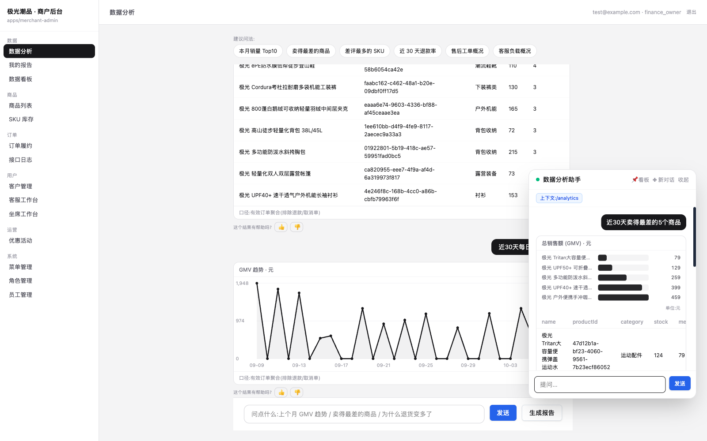
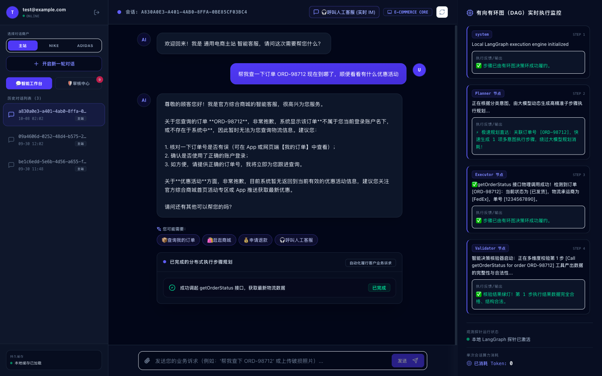
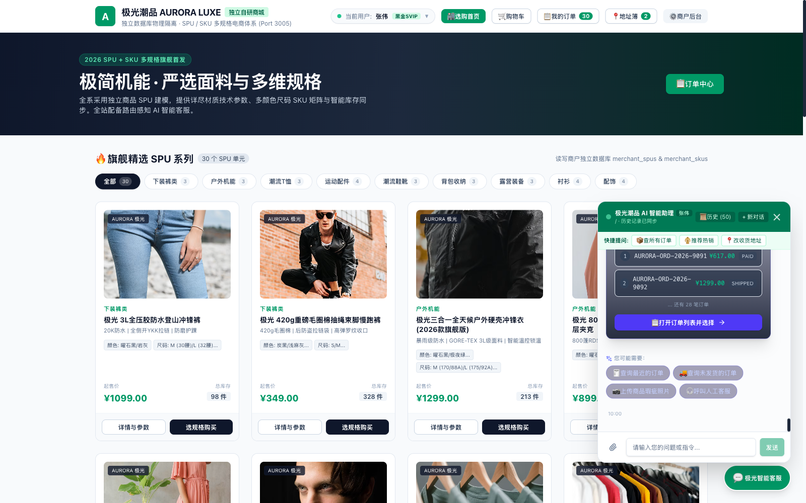
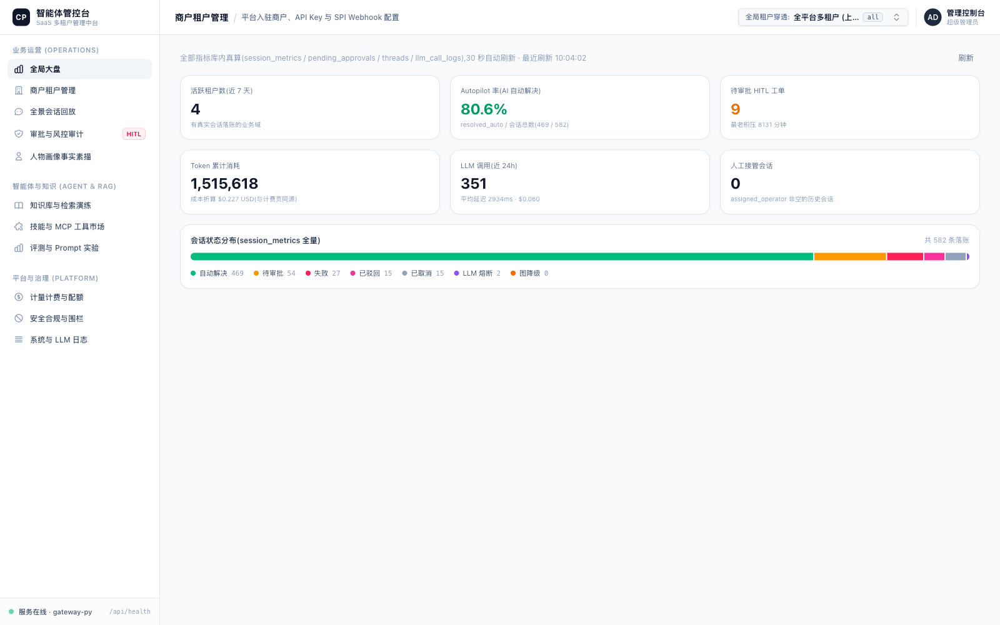
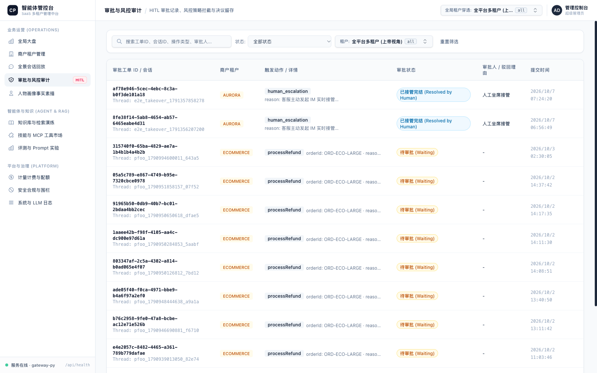

# 🚀 smartServe-agent: 双 Agent 智能体平台 —— 智能客服 + 商户数据分析 (v4 Architecture)

[](https://github.com/weizheng1992/smartServe-agent/actions/workflows/ci.yml)

smartServe-agent 是基于 **Turborepo Monorepo**、**Python FastAPI 网关**（128 条注册端点，live OpenAPI 验证）与 **LangGraph 双决策图** 构建的生产级多租户智能体平台。v4 在智能客服 Agent 之上新增**商户数据分析 Agent**（语义层分层信任路线:T0 核验/T1 组合/T2 探索三通道，LLM 永不在无守卫、无标注的情况下产 SQL），并交付**优惠营销资金链**（建券→展示→领券→下单核销→统计对账）、**双端真实登录**、**RBAC 权限体系**与**小模型训练影子接入**全链路。

---

## 📸 平台实览 (Screenshots)

**⭐ 商户数据分析 Agent** — `apps/merchant-admin` (Port 3006):全屏分析工作台 + 全局悬浮助手（上下文感知，任意路由可唤起），ResultCard 同形渲染——图表 + 数据表 + 口径注记 + AI 速览 + CSV 导出：



| 客户端聊天 + LangGraph DAG 实时监控 (`apps/web`) | 商城消费者端 + 悬浮智能客服 (`apps/merchant`) |
|---|---|
|  |  |

| SaaS 管控台 · 全局大盘 (`apps/admin`) | HITL 审批与风控审计 (`apps/admin`) |
|---|---|
|  |  |

> 左上图:`apps/web` 右栏为 **有向有环图(DAG)实时执行监控**——triage/planner/executor/validator 每个节点的执行反馈逐条直播；右上图：商城悬浮客服真答订单查询（订单列表卡 + 追问建议）。左下图：管控台大盘全部指标**库内真算**（session_metrics / pending_approvals / threads / llm_call_logs）；右下图：HITL 审批工单全量留痕（超阈值退款拦截、人工接管结案）。

---

## 💡 版本演进

- **v4.1 分层信任架构（2026-10-07，即 [CHANGELOG](CHANGELOG.md) [2.7.0]；[ADR-0010](docs/adr/0010-tiered-trust-architecture.md)/[ADR-0011](docs/adr/0011-attribution-phase-b-boundary.md) 落地）**：data agent 升级**分层信任梯度**——语义层单一事实源（`tools_registry/semantic_model.yaml` 12 实体/9 join/8 维度，`semantic_model.py` 加载即校验 + `semantic_compiler.py` 声明编译器，23 规整族迁声明编译、13 bespoke 族债务清单逃生舱）；**T1 组合通道**（`AI_T1_COMPOSE=on` 灰度：LLM 产 CompositionQuery、编译器拼 SQL；**语感直通** breakdown_reroute——「各品牌净销售额」零 LLM 升格组合；**时间平移** compare_previous 双期 CTE）与 **T2 探索通道**（`AI_T2_EXPLORE=on` ∧ admin/finance_owner 双闸：LLM 接地生成 SQL 过守卫链强制审计，`generatedSql` 折叠可审）先后开闸，结果卡三档信任章（verified/composed/explored）；**归因卡**（本期 vs 上期贡献度分解 + 退款率对照列 + AI 叙事隔离章，叙事数字可溯源硬校验，`AI_ATTR_NARRATIVE` 默认关）；闭集 39 指标（新增 net_sales 净销售额）+ 品牌/区域/城市维度；答案反馈闭环 👍/👎（第 40 条路由，traceId 台账/坏例池扇出）；意图评测语料 101 → **572 句**。
- **v4 双 Agent 平台（2026-09-19，wayfinder「商城/商户 data agent 双模块重构」收官）**：新增商户**数据分析 Agent**（14 指标语义注册表起步，LLM 只解析意图、永不写 SQL；sqlglot 四层安全闸；折线图/表格卡）；**优惠营销资金链**端到端（后台建三类活动→商城促销价/领券→下单自动算优惠+核销→客服对话可问→data agent 统计）；**`apps/merchant-admin` 独立商户后台**（真实登录+注册、RBAC 菜单/角色/员工三件套、六页全 CRUD、报告导出）；**小模型训练影子接入**（词表弱标注 590 句 → bge+线性头 heldout 98.9%，三态环境变量灰度）。详见 [ADR-0004](docs/adr/0004-semantic-layer-route-and-dual-agent-seam.md) 与 [训练文档](docs/training/metric-head-training.md)。
- **v3.2 页面组件化（2026-09-19）**：merchant-admin 按菜单域文件夹全页面拆分，Workbench 多 tab 门控（一次只渲染当前域）。
- **v3.1 运营真实化（2026-09-07）**：真实登录（bcrypt+JWT）、限流、LLM 熔断/退避、评测真实入库。
- **v3**：后端整体 Python 化（FastAPI 网关 + LangGraph 引擎 + SQLAlchemy/Alembic），契约路由 pytest 钉死。
- **v2 / v1**：分层中台重构 / 初代单体（分支 `v1-main`）。

> 逐版本明细见 [CHANGELOG.md](CHANGELOG.md)（2.6.x 为 v4 收官后的日粒度演进：夜间评测基建、run_agent 性能批、双退款 TOCTOU、mall_domain 神类拆解、审批 SETNX 误判修复等）。

---

## 🖥️ 四大终端 (Four Terminals)

| 终端 | 端口 | 面向 | 核心能力 |
|---|---|---|---|
| **apps/web** | 3000 | 终端用户（轻量） | 多模态聊天、富卡片、SSE 流式、DAG 执行监控 |
| **apps/admin** | 3001 | SaaS 平台运维 | 11 大管控模块、HITL 审批、全景会话回放、全链路 Trace |
| **apps/merchant** | 3005 | 商城消费者 | 极光潮品商城、悬浮客服、**真实登录/注册**、**促销价/领券** |
| **apps/merchant-admin** | 3006 | 商户员工/老板 | **数据分析 Agent**（悬浮+全屏+数据看板）、订单/商品/客户 CRUD、优惠活动管理、RBAC 三件套、报告导出 |

`merchant-admin` 为 v4 新增独立应用（Vite 6 + React 19，组件库强制 `packages/ui`）：全局悬浮数据分析助手任意路由可唤起（上下文=当前路由+选中数据），按菜单域组织页面，老板可快捷切换员工身份。

---

## 🤖 双 Agent 架构 (Dual-Agent Architecture)

```text
┌─────────────────────────────────────────────────────────────────────────┐
│                      apps/merchant-admin (Port 3006)                     │
│   数据分析全屏工作台 + 全局悬浮 Agent · RBAC 菜单/角色/员工 · 报告导出   │
└──────────────────────────────┬──────────────────────────────────────────┘
                               │ /api/admin/analytics/* (员工面 JWT, 40 条路由)
                               ▼
┌─────────────────────────────────────────────────────────────────────────┐
│              商户数据分析 Agent (engine_py/analytics/, 独立轻管线)        │
│                                                                         │
│   intake(PageContext 选中实体)                                          │
│     → resolve: L0 词表归一 → 分类头(小模型缝②) → LLM 兜底反问           │
│     → compile: 语义模型声明编译(23 规整族) + 13 bespoke 族手写模板      │
│     → execute: 只读 reader 引擎(READ ONLY + 超时 + SAVEPOINT)           │
│     → 卡片: 表格/折线图(SVG) + 口径注记 + 三档信任章                     │
│                                                                         │
│   39 指标 × 8 域 + 语义模型(12 实体/9 join/8 维度)                      │
│   意图分层: L0 词表 → 小模型分类头 → L2 范例回放 → L3 LLM/SFT 兜底     │
│   全层未命中 → T1 组合(语感直通/LLM) → T2 探索(守卫链) → 响亮失败      │
│   落 agent_unanswered(覆盖增长闭环,不编造答案);归因卡(贡献度分解)     │
│   👍/👎 反馈闭环(traceId → 台账/坏例池)                                │
└──────────────────────────────┬──────────────────────────────────────────┘
                               │ (与商城客服 Agent 共享: 会话/推送/卡片约定)
                               ▼
┌─────────────────────────────────────────────────────────────────────────┐
│            智能客服 Agent (graph/ + triage/ + skills/, LangGraph)        │
│   triage(意图分流+槽位) → planner → executor ⇄ validator → finish       │
│   + PromotionQuerySkill(优惠/券问答) + 语义缓存 + ApprovalGatekeeper    │
└─────────────────────────────────────────────────────────────────────────┘
```

> **为什么 LLM 永不写 SQL**：数据 agent 的 LLM 只负责把口语解析为闭集结构化意图（指标/维度/方向/时间窗），SQL 由语义编译器确定性拼装（口径烧在声明里，退款单不可能混进销量）。T2 探索通道是唯一例外——LLM 接地生成的 SQL 必须过 sqlglot 守卫链强制审计（围栏剥离 → ParseError 归类响亮拒绝 → LIMIT 强制 → 表白名单 → 只读 reader）。路线论证见 [ADR-0004](docs/adr/0004-semantic-layer-route-and-dual-agent-seam.md)，分层信任演进见 [ADR-0010](docs/adr/0010-tiered-trust-architecture.md)。

---

## 🎁 优惠营销资金链 (Promotion Lifecycle)

```text
商户后台建活动(满减/折扣/券, RBAC 限老板/运营)
    ↓
商城首页横幅 + 商品促销价(服务端唯一算价) + 商品页领券(用户级券实例)
    ↓
下单结算: 自动匹配最优活动(券 vs 满减取大, SAVEPOINT 隔离)
          实付 = 原价 − 优惠, promotion_redemptions 核销落库
    ↓
客服对话: 「有什么优惠活动」「我的优惠券」→ PromotionQuerySkill 真答
    ↓
data agent: 「各活动核销订单数」「优惠总额」→ 与造数逐笔对账
```

---

## 🧠 小模型训练与影子接入 (Small Model Pipeline)

```text
词表弱标注(590 句×11 类, seed_from_registry.py)
    → prepare_data(去重 + 评测近邻过滤 cos≥0.90 + 分层切分)
    → train(bge 冻结编码 + torch 线性头, CPU 2 分钟)
    → evaluate(heldout accuracy 98.88% / macro F1 0.907)
    → 部署: AI_METRIC_HEAD=shadow(并行打分记日志) → on(L0 未命中处接管)
    回滚 = 移除环境变量
```

- 数据水龙头：`services/engine-py/src/engine_py/intent_flywheel/export_intent_data.py`（`python -m engine_py.intent_flywheel.export_intent_data`；intent_logs/badcase 持续积累按时间窗导出 JSONL）
- 意图评测语料：`services/engine-py/evals/intent_cases.jsonl`（**572 句**：槽位程序生成 + 65 条 T2 型长尾，词面碰撞检查）
- 完整文档：[docs/training/metric-head-training.md](docs/training/metric-head-training.md)（数据源/格式/库/参数/部署全链路）
- 训练脚手架：`services/engine-py/scripts/training/`（README 含复现三命令）

### 🎯 SFT 轨（SemQL 意图解析，2026-09-21 已跑通）

```text
sft_dataset(词面 × 时间窗 × 品类 × limit 程序化组合, 4478 条, 评测纯门零泄漏)
    → 云训(PAI-DSW 免费包 A10 单卡, QLoRA nf4, 1680 步 23:49 完整跑完)
    → vLLM 自测三问槽位全中(含"卖得最差"→ASC 方向翻转 08-P1 回归门)
    → 部署: vLLM/Ollama 端点 → AI_BASE_URL 切换(影子跑 → promptfoo 达标)
    回滚 = 环境变量改回一行
```

- **训练结果**：loss 1.38→0.012 平台、token 准确率 99.6%；标准 transformers+peft+trl 栈（unsloth 补丁层注入坏 eos 已弃用）；adapter 154MB 不入库（gitignore，备份在本地 zip 与云端实例）
- **训练实录**（三坑排障 / 计算时账 ≈45/250 / 自测实录）：[docs/pai-dsw-sft-run-20260920.md](docs/pai-dsw-sft-run-20260920.md)
- **部署测评指南**（vLLM 自测 / 本地 Ollama / PAI-EAS / 42 条字段准确率脚本）：[docs/sft-deploy-eval.md](docs/sft-deploy-eval.md)
- 双轨总览：`services/engine-py/scripts/training/README.md`

---

## 📁 目录结构 (Monorepo Layout)

仅列目录层级（全部目录，不含文件）；各目录职责见注释。

```text
smartServe-agent/
├── apps/                                  # 四大前端 (Vite 6 + React 19, Bun workspaces)
│   ├── admin/                             # SaaS 控制平面 (Port 3001)
│   │   ├── src/pages/                     #   11 大管控模块,每模块一目录(多数带 components/)
│   │   │   ├── dashboard/                 #     全局大盘(指标库内真算)
│   │   │   ├── tenants/                   #     商户租户管理
│   │   │   ├── conversations/             #     全景会话回放
│   │   │   ├── audits/                    #     审批与风控审计(HITL)
│   │   │   ├── personas/                  #     人物画像事实素描
│   │   │   ├── rag-studio/                #     知识库与检索演练
│   │   │   ├── skills-tools/              #     技能与 MCP 工具市场
│   │   │   ├── evals/                     #     评测与 Prompt 实验
│   │   │   ├── billing/                   #     计量计费与配额
│   │   │   ├── guardrails/                #     安全合规与围栏
│   │   │   └── system-logs/               #     系统与 LLM 日志
│   │   ├── src/components/{crud,layout}/  #   统一 CRUD 套件 + 布局壳
│   │   └── src/{hooks,lib,store}/ · e2e/ · tests/
│   ├── web/                               # 轻量客服端 (Port 3000)
│   │   ├── src/components/                #   聊天 UI(含 audit/ 审计卡片)
│   │   └── src/{pages,hooks,lib}/ · components/ · e2e/{fixtures,helpers}/ · tests/ · public/uploads/
│   ├── merchant/                          # 商城消费者端 (Port 3005)
│   │   ├── src/components/{chat,orders,address,navbar}/
│   │   └── src/{pages,context,lib}/ · e2e/
│   └── merchant-admin/ ⭐                 # 商户独立后台 (Port 3006, 按菜单域组织)
│       ├── src/pages/                     #   每域一目录(多数带 components/)
│       │   ├── analytics/                 #     数据分析全屏工作台(悬浮助手/ResultCard/信任章)
│       │   ├── board/                     #     数据看板
│       │   ├── reports/                   #     我的报告(CSV 导出)
│       │   ├── order-manager/             #     订单工作台(orders/approvals/live-desk/spi-logs 四 tab)
│       │   ├── goods/{products,skus}/     #     商品 CRUD + SKU 库存
│       │   ├── customers/                 #     客户管理
│       │   ├── promotions/                #     优惠活动 CRUD+核销
│       │   ├── live-desk/                 #     客服/坐席工作台
│       │   ├── login/                     #     真实登录(bcrypt+JWT)
│       │   └── system/{menus,roles,staff}/  #  RBAC 三件套
│       └── src/{components,lib,test}/ · e2e/ · public/
│
├── services/                              # Python 后端 (uv workspace)
│   ├── gateway-py/                        # FastAPI 网关 (Port 4000, 128 条端点)
│   │   ├── src/gateway_py/routers/        #   八路由域: analytics/merchant/admin/crud/chat/auth/spi/live_desk
│   │   └── tests/                         #   375+3skip 契约测试(事实标准)
│   └── engine-py/                         # LangGraph 决策引擎
│       ├── src/engine_py/
│       │   ├── analytics/                 #   ⭐ data agent 独立轻管线(语义编译/T0·T1·T2 三通道/守卫链/信任章)
│       │   ├── graph/nodes/               #   客服 LangGraph 拓扑(triage→planner→exec⇄val→finish)
│       │   ├── triage/stages/             #   意图分流(分类头缝①)
│       │   ├── skills/{cart,guide}/       #   技能管道 + 确定性兜底分发(LLM 不可达仍真答)
│       │   ├── tools_registry/            #   工具/指标语义注册表(闭集 39 指标 + 语义层事实源)
│       │   │   └── mall/                  #     商户域四簇(cart/catalog/addresses/fulfillment)
│       │   ├── approvals/                 #   HITL 审批 + 事务发件箱
│       │   ├── memory/                    #   四象限记忆 + 双层画像
│       │   ├── rag/                       #   Contextual RAG(混合检索)
│       │   ├── vision/                    #   多模态视觉消歧
│       │   ├── {llm,cards,badcase,db,evals}/  #  LLM 接入/卡片家族/坏例池/DB 模型/离线评测
│       │   └── intent_flywheel/           #   ⭐ 意图数据飞轮 CLI(七件)
│       ├── alembic/versions/              #   DB 迁移
│       ├── evals/                         #   意图评测语料(572 句)
│       ├── tests/                         #   1571 测试
│       ├── scripts/training/{,configs}/   #   小模型训练脚手架
│       └── training_data/{metric_head,sft}/  #  训练数据与产物
│
├── packages/                              # 共享工作区包
│   ├── types/src/                         #   冻结前端契约类型(zod)
│   └── ui/                                #   零组件库依赖共享 UI
│       └── src/components/{ui,chat/cards,approval}/ · src/{hooks,lib,styles}/ · tests/
│
├── eval/                                  # promptfoo 评测
│   ├── prompts/ · providers/ · scorers/ · lib/
│   ├── testCases/{ecommerce,data_analytics,legal,persona,security}/
│   └── {baselines,results}/ · nightly/results/<时间戳>/   #   夜间评测逐轮留档
│
├── e2e/                                   # Playwright 配置(主套件 + 熔断/商户/审计独立配置链式)
├── docs/
│   ├── adr/                               #   架构决策记录(0001-0011)
│   ├── architecture/                      #   深度设计(RAG/HITL/多模态/扩容)
│   ├── specs/ · wayfinder/{mall-data-agent-split,dynamic-analytics}/  #  规格 + 决策票图谱
│   ├── {training,knowledge,agents}/       #   训练文档 / 知识库 / agent 协作规则
│   └── assets/readme/                     #   README 截图(四终端实览)
├── deploy/                                # 部署物: {k8s,lb,monitoring,embedding}/(K8s 清单/负载均衡/监控/TEI)
├── scripts/                               # 仓库级工具脚本(含 debug/)
├── public/uploads/                        # 运行时上传产物
└── .github/workflows/                     # CI
```

---

## 🔌 核心基础设施 (Platform Core)

以下平台核心能力自 v3 起稳定，深度设计详见 `docs/architecture/` 与对应 ADR：

- **客服 Agent 决策图**：triage(意图分流+咨询直答快轨) → planner(规划/快轨) → executor ⇄ validator → finish；确定性兜底分发器（LLM 不可达时优惠/券/订单状态仍真答）。
- **HITL 审批**：ApprovalGatekeeper（双退款/阈值/高额改址拦截）+ 事务发件箱（审批状态与 outbox 事件同事务原子提交）+ 同步 Fast-Path 恢复（确定性 JobId 派发 run_agent 续跑）+ Outbox 对账 Worker（`FOR UPDATE SKIP LOCKED`；周期任务由 scheduler 随 gateway lifespan 调度，[ADR-0007](docs/adr/0007-temporal-execution-route-retired.md) Temporal 路线已退役）。
- **四层记忆**：short/long/episodic/task（AgentMemoryEngine 统一收集与落盘）。
- **Contextual RAG**：BM25+向量+RRF 混合检索，知识文件自愈补灌。
- **参数化 SQL 沙箱**：sqlglot AST 只读审计 + `READ ONLY` 事务 + 超时熔断 + `LIMIT` 约束；租户边界由服务端模板注入 + 编译层断言（谓词不可剥离，`require_business_id`）。
- **多租户隔离**：business_id 强制过滤、PII 递归脱敏、SQL 下推隔离。
- **实时协同**：Redis Streams 事件主干 + Last-Event-ID SSE 回放 + socket.io 坐席接管。
- **开放 SPI**：HMAC-SHA256 签名 + 防重放，对接商户私有 ERP/WMS。

---

## 🧪 测试 (Testing, 全量绿)

| 套件 | 数量 | 覆盖 |
|---|---|---|
| engine pytest | **1571** | 意图仲裁/视觉消歧/记忆/优惠引擎/golden SQL/兜底分发器/RBAC/报告/数据水龙头/训练流水线/data agent 管线；2.7.0 新增语义编译器差分对拍/组合通道/探索守卫/归因速览/语感直通契约册 |
| gateway pytest | **375+3skip** | HTTP/SSE/socket.io 契约 + analytics 路由 40 条 84 例(ask SSE/反馈/RBAC/报告/核销幂等) |
| merchant-admin vitest | **168** | ResultCard 渲染(信任章/generatedSql 折叠/叙事隔离区)/FloatingAgent/菜单树/SKU 库存/客户抽屉/活动范围/page-context/答案反馈 |
| merchant-admin E2E | **11** | 登录门卫/RBAC 菜单/六胶囊真答/悬浮 agent/报告/优惠 CRUD |
| promptfoo | 就绪 | 统一意图册 58(槽位程序生成+T2 型长尾) / planner 8 / persona 8 / T1·T2 通道十轮守卫基线 — 需模型代理在线 |

```bash
bun run test:engine        # engine 全量 (1571)
bun run test:eval          # gateway 全量 (375)
bun run test:e2e           # Playwright E2E
bun run test:prompt        # promptfoo 意图评估
cd apps/merchant-admin && bun run build   # tsc + vite
```

---

## 🚀 快速启动 (Quick Start)

```bash
bun install && uv sync                    # 依赖(services/ 下 uv sync)
cp .env.example .env                      # LLM/DB/Redis 凭据
bun run docker:up                         # PostgreSQL + Redis
bun run db:push && bun run db:seed        # 迁移 + 种子(含测试账号 test@example.com / agent-all-dev)

bun run dev:all                           # 四前端(turbo): web 3000 / admin 3001 / merchant 3005 / merchant-admin 3006
bun run dev:server                        # FastAPI 网关 (Port 4000, uvicorn --reload)
```

| 服务 | 地址 | 说明 |
|---|---|---|
| apps/web | :3000 | 轻量客服端(登录 test@example.com / agent-all-dev) |
| apps/admin | :3001 | SaaS 控制平面(免登录演示视角) |
| apps/merchant | :3005 | 商城消费者端(真实登录，演示账号一键切换) |
| **apps/merchant-admin** | **:3006** | **商户后台(数据分析/优惠/RBAC，老板账号 test@example.com)** |
| gateway-py | :4000 | FastAPI 网关(128 条端点) |

> **灰度开关**（分层信任三通道）：`AI_T1_COMPOSE=on` 开 T1 组合通道；`AI_T2_EXPLORE=on` 且 admin/finance_owner 身份开 T2 探索；`AI_ATTR_NARRATIVE=on` 开归因叙事（默认关）。周期任务（审批对账/坏例池摘要）由 scheduler 随 gateway lifespan 自动启动，单实例假设；`ENGINE_SCHEDULER_ENABLED=0` 可整体关闭，多实例部署见 [扩容指南](docs/architecture/multi-instance-deployment.md)。

---

## 📚 深度文档 (Deep Docs)

| 文档 | 内容 |
|---|---|
| [ADR-0010](docs/adr/0010-tiered-trust-architecture.md) | **分层信任架构**（T0 核验/T1 组合/T2 探索三通道 + 语义层单一事实源） |
| [ADR-0011](docs/adr/0011-attribution-phase-b-boundary.md) | 归因增强边界（贡献度分解 B1 + AI 叙事隔离章 B2） |
| [ADR-0004](docs/adr/0004-semantic-layer-route-and-dual-agent-seam.md) | 语义层路线(LLM 永不写 SQL)+双 Agent 模块缝 |
| [ADR-0005](docs/adr/0005-data-agent-llm-intent-and-growth-loop.md) | L3 LLM 意图兜底 + 覆盖增长机制(未命中落库) |
| [ADR-0006](docs/adr/0006-data-agent-architecture-comparison.md) | **架构对照:LangGraph+MetaRAG+GRPO 全家桶提案 vs 语义层轻管线**——逐层采用/暂不采用/明确不采用的理由与重新评估触发器 |
| [训练文档](docs/training/metric-head-training.md) | 小模型数据源/格式/库/参数/部署全链路 |
| [商户接入指南](docs/merchant-onboarding-guide.md) | SPI 对接/RAG 灌入/审批策略 |
| [架构深度指南](docs/architecture/) | RAG/HITL 重规划/弹性部署/多实例扩容 |
| **[生产部署方案](docs/deploy.md)** | **Docker Compose 全栈上线:四前端 nginx 一体/gateway/PG/Redis,五步上线+运维+安全清单** |
| [CHANGELOG](CHANGELOG.md) | 版本明细（2.7.0 = v4.1；2.6.x 日粒度演进持续回填） |

---

## 📄 历史版本

- **v3.2 / v3.1 / v3 / v2 / v1**：见 [CHANGELOG.md](CHANGELOG.md) 与 git tag（v1 在分支 `v1-main`）。
